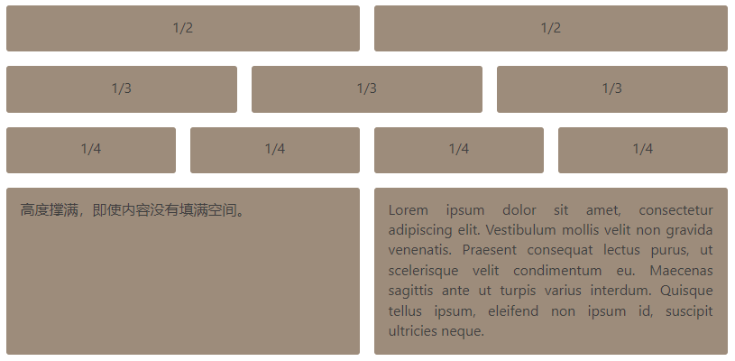

```css
.Demo {
        background: lime;
    }
```

参考：
<a href="https://www.ruanyifeng.com/blog/2015/07/flex-grammar.html">Flex布局教程：语法篇</a>
<a href="https://www.ruanyifeng.com/blog/2015/07/flex-examples.html">Flex布局教程：实例篇</a>
<a href="https://www.ruanyifeng.com/blog/2018/10/flexbox-form.html">Flexbox布局的最简单表单</a>

## Flex布局教程：语法篇

以下内容主要参考了下面两篇文章：
<a href="https://css-tricks.com/snippets/css/a-guide-to-flexbox/">A Complete Guide to Flexbox</a>
<a href="https://scotch.io/tutorials/a-visual-guide-to-css3-flexbox-properties">A Visual Guide to CSS3 Flexbox Properties</a>

### 一、Flex布局是什么？

Flex是Flexible Box的缩写，意为"弹性布局"，用来为盒状模型提供最大的灵活性。任何一个容器均可指定为Flex布局。

```css
.box {
  display: flex;
}
```

行内元素也可使用Flex布局。

```css
.box {
  display: inline-flex;
}
```

Webkit内核的浏览器，必须加上-webkit前缀。

```css
.box {
  display: -webkit-flex; /* Safari */
  display: flex;
}
```

注意，设为Flex布局以后，子元素的float、clear和vertical-align属性将失效。

### 二、基本概念

采用Flex布局的元素，称为Flex容器(flex container)，简称"容器"。容器的所有子元素自动成为容器成员，称为Flex项目(flex item)，简称"项目"。


容器默认存在两根轴：水平的主轴(main axis)和垂直的交叉轴(cross axis)。主轴的开始位置(与边框的交叉点)称为main start，结束位置称为main end；交叉轴的开始位置称为cross start，结束位置称为cross end。

项目默认沿主轴排列。单个项目占据的主轴空间称为main size，占据的交叉轴空间称为cross size。

### 三、容器的属性

在容器上可设置以下6个属性：

- flex-direction
- flex-wrap
- flex-flow
- justify-content
- align-items
- align-content

##### 3.1 flex-direction属性

- flex-direction属性决定主轴的方向(即项目的排列方向)，其可能取以下4个值：
- row(默认值)：主轴为水平方向，起点在左端；
- row-reverse：主轴为水平方向，起点在右端；
- column：主轴为垂直方向，起点在上沿；
- column-reverse：主轴为垂直方向，起点在下沿；


##### 3.2 flex-wrap属性

默认情况下，项目均排在一条线(又称"轴线")上。flex-wrap属性定义，若一条轴线排不下，如何换行，其可能取以下3个值。

- nowrap(默认)：不换行；
- wrap：换行，第一行在上方；
- wrap-reverse：换行，第一行在下方；


##### 3.3 flex-flow

flex-flow属性是flex-direction属性和flex-wrap属性的简写形式，默认值为row nowrap。

```
.box {
  flex-flow: <flex-direction> || <flex-wrap>;
}
```

##### 3.4 justify-content属性

justify-content属性定义了项目在主轴上的对齐方式，
其可能取以下5个值，具体对齐方式与轴的方向有关。下面假设主轴为从左到右：

- flex-start(默认值)：左对齐；
- flex-end：右对齐；
- center：居中；
- space-between：两端对齐，项目之间的间隔均相等；
- space-around：每个项目两侧的间隔相等。所以，项目之间的间隔比项目与边框的间隔大一倍；


##### 3.5 align-items属性

align-items属性定义项目在交叉轴上如何对齐，其可能取以下5个值。具体的对齐方式与交叉轴的方向有关，下面假设交叉轴从上到下：

- flex-start：交叉轴的起点对齐；
- flex-end：交叉轴的终点对齐；
- center：交叉轴的中点对齐；
- baseline:项目的第一行文字的基线对齐；
- stretch(默认值)：若项目未设置高度或设为auto，将占满整个容器的高度；


##### 3.6 align-content属性

align-content属性定义了多根轴线的对齐方式。若项目只有一根轴线，该属性不起作用，其可能取以下6个值：

- flex-start：与交叉轴的起点对齐；
- flex-end：与交叉轴的终点对齐；
- center：与交叉轴的中点对齐；
- space-between：与交叉轴两端对齐，轴线之间的间隔平均分布；
- space-around：每根轴线两侧的间隔均相等，因此，轴线之间的间隔比轴线与边框的间隔大一倍；
- stretch(默认值)：轴线占满整个交叉轴；


### 四、项目的属性

以下6个属性设置在项目上：

- order
- flex-grow
- flex-shrink
- flex-basis
- flex
- align-self

##### 4.1 order属性

order属性定义项目的排列顺序。数值越小，排列越靠前，默认为0。


##### 4.2 flex-grow属性

flex-grow属性定义项目的放大比例，默认为0，即若存在剩余空间，也不放大。

若所有项目的flex-grow属性均为1，则它们将等分剩余空间(若有的话)。若一个项目的flex-grow属性为2，其他项目均为1，则前者占据的剩余空间将比其他项多一倍。

##### 4.3 flex-shrink属性

flex-shrink属性定义了项目的缩小比例，默认为1，即若空间不足，该项目将缩小。

若所有项目的flex-shrink属性均为1，当空间不足时，均将等比例缩小。若一个项目的flex-shrink属性为0，其他项目均为1，则空间不足时，前者不缩小。
负值对该属性无效。

##### 4.4 flex-basis属性

flex-basis属性定义了在分配多余空间之前，项目占据的主轴空间(main size)。浏览器根据这个属性，计算主轴是否有多余空间。默认值为auto，即项目的本来大小。其可设为跟width或height属性一样的值(比如350px)，则项目将占据固定空间。

##### 4.5 flex属性

flex属性是flex-grow, flex-shrink和flex-basis的简写，默认值为0 1 auto。后两个属性可选。此属性有两个快捷值：auto (1 1 auto)和none (0 0 auto)。
建议优先使用此属性，而不是单独写三个分离的属性，因为浏览器会推算相关值。

##### 4.6 align-self属性

align-self属性允许单个项目有与其他项目不一样的对齐方式，可覆盖align-items属性。默认值为auto，表示继承父元素的align-items属性，若没有父元素，则等同于stretch。
此属性可能取6个值，除了auto，其他均与align-items属性完全一致。

(完)


## Flex布局教程：实例篇

上一篇文章介绍了Flex布局的语法，今天介绍常见布局的Flex写法。你会看到，不管是什么布局，Flex往往均可几行命令搞定。

我只列出代码，详细的语法解释请查阅《Flex布局教程：语法篇》。我的主要参考资料是<a href="http://davidwalsh.name/flexbox-dice">Landon Schropp</a>的文章和<a href="http://philipwalton.github.io/solved-by-flexbox/">Solved by Flexbox</a>。

### 一、骰子的布局

骰子的一面，最多可放置9个点。


下面，就来看看Flex如何实现，从1个点到9个点的布局。你可到codepen查看Demo。


若不加说明，本节的HTML模板一律如下。


<div class="box">
  <span class="item"></span>
</div>
上面代码中，div元素(代表骰子的一个面)是Flex容器，span元素(代表一个点)是Flex项目。若有多个项目，就要添加多个span元素，以此类推。

#### 1.1单项目

首先，只有左上角1个点的情况。Flex布局默认就是首行左对齐，所以一行代码就够了。


<style type="text/css">
.box {
  display: flex;
}
</style>
设置项目的对齐方式，就能实现居中对齐和右对齐。


<style type="text/css">
.box {
  display: flex;
  justify-content: center;
}
</style>

<style type="text/css">
.box {
  display: flex;
  justify-content: flex-end;
}
</style>
设置交叉轴对齐方式，可垂直移动主轴。


<style type="text/css">
.box {
  display: flex;
  align-items: center;
}
</style>

<style type="text/css">
.box {
  display: flex;
  justify-content: center;
  align-items: center;
}
</style>

<style type="text/css">
.box {
  display: flex;
  justify-content: center;
  align-items: flex-end;
}
</style>

<style type="text/css">
.box {
  display: flex;
  justify-content: flex-end;
  align-items: flex-end;
}
</style>
#### 1.2双项目

<style type="text/css">
.box {
  display: flex;
  justify-content: space-between;
}


.box {
  display: flex;
  flex-direction: column;
  justify-content: space-between;
}


.box {
  display: flex;
  flex-direction: column;
  justify-content: space-between;
  align-items: center;
}


.box {
  display: flex;
  flex-direction: column;
  justify-content: space-between;
  align-items: flex-end;
}


.box {
  display: flex;
}

.item:nth-child(2) {
  align-self: center;
}


.box {
  display: flex;
  justify-content: space-between;
}

.item:nth-child(2) {
  align-self: flex-end;
}
</style>

#### 1.3三项目

<style type="text/css">
.box {
  display: flex;
}

.item:nth-child(2) {
  align-self: center;
}

.item:nth-child(3) {
  align-self: flex-end;
}
</style>

#### 1.4四项目

<style type="text/css">
.box {
  display: flex;
  flex-wrap: wrap;
  justify-content: flex-end;
  align-content: space-between;
}
</style>


HTML代码如下。


<div class="box">
  <div class="column">
    <span class="item"></span>
    <span class="item"></span>
  </div>
  <div class="column">
    <span class="item"></span>
    <span class="item"></span>
  </div>
</div>
CSS代码如下。
<style type="text/css">
.box {
  display: flex;
  flex-wrap: wrap;
  align-content: space-between;
}
.column {
  flex-basis: 100%;
  display: flex;
  justify-content: space-between;
}
</style>

#### 1.5六项目

<style type="text/css">
.box {
  display: flex;
  flex-wrap: wrap;
  align-content: space-between;
}


.box {
  display: flex;
  flex-direction: column;
  flex-wrap: wrap;
  align-content: space-between;
}
</style>


HTML代码如下。


<div class="box">
  <div class="row">
    <span class="item"></span>
    <span class="item"></span>
    <span class="item"></span>
  </div>
  <div class="row">
    <span class="item"></span>
  </div>
  <div class="row">
     <span class="item"></span>
     <span class="item"></span>
  </div>
</div>
CSS代码如下。
<style type="text/css">
.box {
  display: flex;
  flex-wrap: wrap;
}

.row{
  flex-basis: 100%;
  display:flex;
}

.row:nth-child(2){
  justify-content: center;
}

.row:nth-child(3){
  justify-content: space-between;
}
</style>

#### 1.6九项目

```css
.box {
  display: flex;
  flex-wrap: wrap;
}
```


<style>
    .Grid {
        border: 2px dashed purple;
    }
</style>
<div class="Grid Grid--gutters u-textCenter">
  <div class="Grid-cell">
    <div class="Demo" style="background: red;">1/2</div>
  </div>
  <div class="Grid-cell">
    <div class="Demo">1/2</div>
  </div>
</div>




### 二、网格布局

#### 2.1基本网格布局

最简单的网格布局，就是平均分布。在容器里面平均分配空间，跟上面的骰子布局很像，但是需要设置项目的自动缩放。


HTML代码如下。


<div class="Grid">
  <div class="Grid-cell">...</div>
  <div class="Grid-cell">...</div>
  <div class="Grid-cell">...</div>
</div>
CSS代码如下。
<style type="text/css">
.Grid {
  display: flex;
}
.Grid-cell {
  flex: 1;
}
</style>

#### 2.2百分比布局

某个网格的宽度为固定的百分比，其余网格平均分配剩余的空间。


HTML代码如下。


<div class="Grid">
  <div class="Grid-cell u-1of4">...</div>
  <div class="Grid-cell">...</div>
  <div class="Grid-cell u-1of3">...</div>
</div>

<style type="text/css">
.Grid {
  display: flex;
}

.Grid-cell {
  flex: 1;
}

.Grid-cell.u-full {
  flex: 0 0 100%;
}

.Grid-cell.u-1of2 {
  flex: 0 0 50%;
}

.Grid-cell.u-1of3 {
  flex: 0 0 33.3333%;
}

.Grid-cell.u-1of4 {
  flex: 0 0 25%;
}
</style>

### 三、圣杯布局

圣杯布局(Holy Grail Layout)指的是一种最常见的网站布局。页面从上到下，分成三个部分：头部(header)，躯干(body)，尾部(footer)。其中躯干又水平分成三栏，从左到右为：导航、主栏、副栏。


HTML代码如下。


<body class="HolyGrail">
  <header>...</header>
  <div class="HolyGrail-body">
    <main class="HolyGrail-content">...</main>
    <nav class="HolyGrail-nav">...</nav>
    <aside class="HolyGrail-ads">...</aside>
  </div>
  <footer>...</footer>
</body>
CSS代码如下。
<style type="text/css">
.HolyGrail {
  display: flex;
  min-height: 100vh;
  flex-direction: column;
}

header,
footer {
  flex: 1;
}

.HolyGrail-body {
  display: flex;
  flex: 1;
}

.HolyGrail-content {
  flex: 1;
}

.HolyGrail-nav, .HolyGrail-ads {
  /*两个边栏的宽度设为12em */
  flex: 0 0 12em;
}

.HolyGrail-nav {
  /*导航放到最左边*/
  order: -1;
}
</style>
若是小屏幕，躯干的三栏自动变为垂直叠加。
<style type="text/css">
@media (max-width: 768px) {
  .HolyGrail-body {
    flex-direction: column;
    flex: 1;
  }
  .HolyGrail-nav,
  .HolyGrail-ads,
  .HolyGrail-content {
    flex: auto;
  }
}
</style>
### 四、输入框的布局

我们常常需要在输入框的前方添加提示，后方添加按钮。


HTML代码如下。


<div class="InputAddOn">
  <span class="InputAddOn-item">...</span>
  <input class="InputAddOn-field">
  <button class="InputAddOn-item">...</button>
</div>
CSS代码如下。
<style type="text/css">
.InputAddOn {
  display: flex;
}
.InputAddOn-field {
  flex: 1;
}
</style>

### 五、悬挂式布局

有时，主栏的左侧或右侧，需要添加一个图片栏。


HTML代码如下。


<div class="Media">
  
  <p class="Media-body">...</p>
</div>
CSS代码如下。
<style type="text/css">
.Media {
  display: flex;
  align-items: flex-start;
}

.Media-figure {
  margin-right: 1em;
}

.Media-body {
  flex: 1;
}
</style>

### 六、固定的底栏

有时，页面内容太少，无法占满一屏的高度，底栏就会抬高到页面的中间。这时可采用Flex布局，让底栏总是出现在页面的底部。


HTML代码如下。


<body class="Site">
  <header>...</header>
  <main class="Site-content">...</main>
  <footer>...</footer>
</body>
CSS代码如下。
<style type="text/css">
.Site {
  display: flex;
  min-height: 100vh;
  flex-direction: column;
}
.Site-content {
  flex: 1;
}
</style>

### 七，流式布局

每行的项目数固定，会自动分行。


CSS的写法。

<style type="text/css">
.parent {
  width: 200px;
  height: 150px;
  background-color: black;
  display: flex;
  flex-flow: row wrap;
  align-content: flex-start;
}

.child {
  box-sizing: border-box;
  background-color: white;
  flex: 0 0 25%;
  height: 50px;
  border: 1px solid red;
}
</style>
(完)


## Flexbox布局的最简单表单

弹性布局(Flexbox)逐渐流行，越来越多人使用，因为其写CSS布局真是太方便了。

三年前，作者写过Flexbox的介绍(上，下)，但是有些地方写得不清楚。今天，作者看到一篇教程，才意识到一个最简单的表单，就可解释Flexbox，而且内容还很实用。

下面只需要10分钟，便可学会简单的表单布局。

### 一、<form>元素

表单使用<form>元素。

```html
<form></form>
```

上面是一个空表单。根据HTML标准，其是一个块级元素，默认将占据全部宽度，但是高度为0，因为没有任何内容。

### 二、表单控件

现在，加入两个最常用的表单控件。

```
<form>
  <input type="email" name="email">
  <button type="submit">Send</button>
</form>
```

上面代码中，表单包含一个输入框(<input>)和一个按钮(<button>)。

根据标准，这两个控件均是行内块级元素(inline-block)，二者默认并排在一行上。

上图是浏览器对这个表单的默认渲染(颜色除外)，可看到，这两个控件之间有3像素～4像素的间隔，这是浏览器的内置样式指定的。

### 三、指定Flexbox布局

接着，指定表单使用Flexbox布局。

```css
form  {
  display: flex;
}
```

可看到，两个控件之间的间隔消失了，因为弹性布局的项目(item)默认没有间隔。

### 四、flex-grow属性

以下两个地方值得注意：
(1)两个控件元素的宽度没有发生变化，因为弹性布局默认不改变项目的宽度；
(2)弹性布局默认左对齐，所以两个控件会从行首开始排列；
若希望，输入框占据当前行的所有剩余宽度，只需要指定输入框的flex-grow属性为1。

```css
input  {
  flex-grow: 1;
}
```


上图中，按钮的宽度没变，但是输入框变宽了，等于当前行的宽度减去按钮的宽度。

flex-grow属性默认等于0，即使用本来的宽度，不拉伸。等于1时，就表示该项目宽度拉伸，占据当前行的所有剩余宽度。

### 五、align-self属性和align-items属性

下面做一点改变，在按钮里面插入一张图片：

```html
<form action="#">
  <input type="email" placeholder="Enter your email">
  <button type="button"><svg>  <!-- a smiley icon -->  </svg></button>
</form>
```

按钮插入图片后，其高度变了，变得更高了。这时，就发生了一件很奇妙的事情。

上图中，按钮变高了，输入框也自动变得一样高了！

前面说过，弹性布局默认不改变项目的宽度，但是其默认改变项目的高度。若项目没有显式指定高度，就将占据容器的所有高度。本例中，按钮变高了，导致表单元素也变高了，使得输入框的高度自动拉伸了。

align-self属性可改变这种行为，align-self属性可取以下4个值：

- flex-start：顶边对齐，高度不拉伸；
- flex-end：底边对齐，高度不拉伸；
- center：居中，高度不拉伸；
- stretch：默认值，高度自动拉伸；


若项目很多，一个个地设置align-self属性就很麻烦。这时，可在容器元素(本例为表单)设置align-items属性，其值被所有子项目的align-self属性继承。

```css
form {
  display: flex;
  align-items: center;
}
```

上面代码中，<form>元素设置了align-items以后，就不用在控件上设置align-self，除非希望两者的值不一样。

(完)